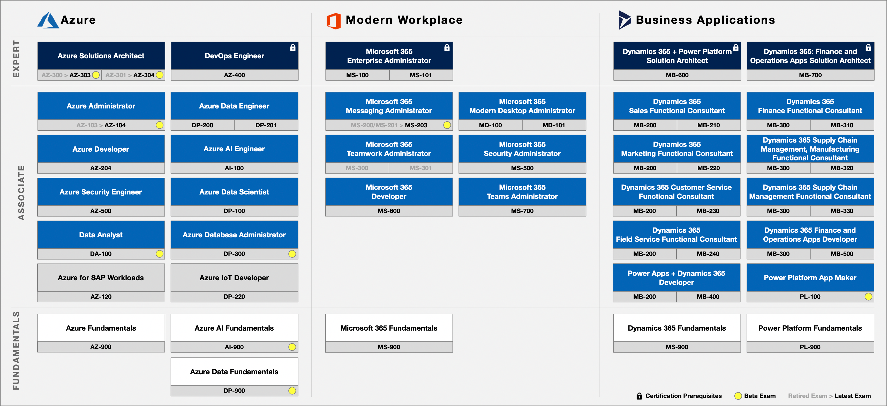
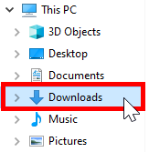

# Microsoft Technical Skills Enablement
A collection of resources to empower the Microsoft community in driving technical intensity with skills.

## Ingredients
* Branded Template
* Sponsors (Executive, L&D, PDM, PTS)
* Technical Competencies by Solution Area
* Target Owners by Business Unit
* Targets (Generalist, Specialist, Associate, Expert)
* Mission Statement
* Role Mapping
* Reporting (Progress Tracker)
* Leaderboard
* Learning Paths (On-Demand, Instructor-Led, Virtual or In-Person)

<a href="#microsoft-partner-technical-skills-enablement">↥ back to top</a>

## Training and Certification Roadmap
 

<a href="#microsoft-partner-technical-skills-enablement">↥ back to top</a>

## Technical Skills Plan
1. Download the **Partner Skills Template** files to your local machine.  
   * [Excel Spreadsheet](../../raw/master/files/Partner%20Skills%20Template.xlsx) (Data Capture)
   * [Power BI Template](../../raw/master/files/Partner%20Skills%20Template.pbit) (Report)
2. Navigate to the **Downloads** directory.  
 
3. 

## Resources
**Microsoft Inspire 2019 (July 14-18, Las Vegas - Nevada)**  
* [How to solve your skills gap](https://myinspire.microsoft.com/sessions/7112d75b-f0c6-4f49-b369-939efe893102)
* [Microsoft certification is critical to keeping your skills updated in a cloud-based world](https://myinspire.microsoft.com/sessions/bb862e48-7249-4065-93a1-2771f29d1083)
* [Worldwide Learning strategy and investments: Our approach to building skills and capability](https://myinspire.microsoft.com/sessions/3fd9a6ff-5994-4eff-ba6c-0f4009e7fcd9)
* [Worldwide Learning partner opportunity: Aligning for success](https://myinspire.microsoft.com/sessions/78e45cba-2705-4701-8235-b4c554678eab)

**Other**
* [Recruit, Hire, Onboard, and Retain Talent Playbook](https://partner.microsoft.com/en-us/campaigns/recruit-hire-onboard-playbook)
* [Microsoft Learn](https://aka.ms/learn)
* [Training and Certification Guide](https://query.prod.cms.rt.microsoft.com/cms/api/am/binary/RWtQJJ)
* [Training and Certification Poster](https://query.prod.cms.rt.microsoft.com/cms/api/am/binary/RE2PjDI)

<a href="#microsoft-partner-technical-skills-enablement">↥ back to top</a>
