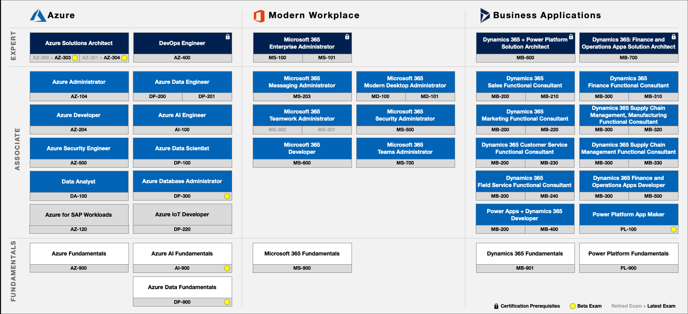
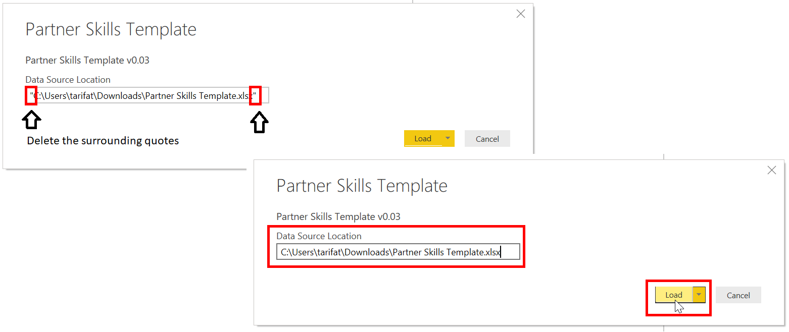

# Microsoft Technical Skills Enablement
A collection of resources to empower the Microsoft community in driving technical intensity with skills.

## Training and Certification Roadmap
 

<a href="#microsoft-partner-technical-skills-enablement">↥ back to top</a>

## Technical Skills Plan
1. Download the **Partner Skills Template** files to your local machine.  
   * [Excel Spreadsheet](../../raw/master/files/Partner%20Skills%20Template.xlsx) (Data Capture)
   * [Power BI Template](../../raw/master/files/Partner%20Skills%20Template.pbit) (Report)
2. Navigate to the **Downloads** directory.  
 
3. Single-click the Excel spreadsheet (**Partner Skills Template.xlsx**)  
 
4. While holding down the **SHIFT** key, right-click on the selected file and click **Copy as path**.  
 
5. Open the Power BI template (**Partner Skills Template.pbit**) by double clicking the file  
 
6. Paste the path into **Data source location**  
 
7. Delete the surrounding double quotes and click **Load**  
 
8. Once the report has loaded, click the **Save** icon  
 
9. Provide the file a name (e.g. Technical Skills Plan) and click **Save**  
 

Congratulations! You have just created an instance of a technical skills plan from the Power BI template. This instance of the skills plan is connected to the underlying spreadsheet. Any changes in the data will be reflected in the report.

Note: If you wanted to create another skills plan, start off by creating a copy of the excel spreadsheet, then repeat the steps above.

<a href="#microsoft-partner-technical-skills-enablement">↥ back to top</a>

## Ingredients
* Branded Template
* Sponsors (Executive, L&D, PDM, PTS)
* Technical Competencies by Solution Area
* Target Owners by Business Unit
* Targets (Generalist, Specialist, Associate, Expert)
* Mission Statement
* Role Mapping
* Reporting (Progress Tracker)
* Leaderboard
* Learning Paths (On-Demand, Instructor-Led, Virtual or In-Person)

<a href="#microsoft-partner-technical-skills-enablement">↥ back to top</a>

## Resources
**Microsoft Inspire 2019 (July 14-18, Las Vegas - Nevada)**  
* [How to solve your skills gap](https://myinspire.microsoft.com/sessions/7112d75b-f0c6-4f49-b369-939efe893102)
* [Microsoft certification is critical to keeping your skills updated in a cloud-based world](https://myinspire.microsoft.com/sessions/bb862e48-7249-4065-93a1-2771f29d1083)
* [Worldwide Learning strategy and investments: Our approach to building skills and capability](https://myinspire.microsoft.com/sessions/3fd9a6ff-5994-4eff-ba6c-0f4009e7fcd9)
* [Worldwide Learning partner opportunity: Aligning for success](https://myinspire.microsoft.com/sessions/78e45cba-2705-4701-8235-b4c554678eab)

**Other**
* [Recruit, Hire, Onboard, and Retain Talent Playbook](https://partner.microsoft.com/en-us/campaigns/recruit-hire-onboard-playbook)
* [Microsoft Learn](https://aka.ms/learn)
* [Training and Certification Guide](https://query.prod.cms.rt.microsoft.com/cms/api/am/binary/RWtQJJ)
* [Training and Certification Poster](https://query.prod.cms.rt.microsoft.com/cms/api/am/binary/RE2PjDI)

<a href="#microsoft-partner-technical-skills-enablement">↥ back to top</a>
