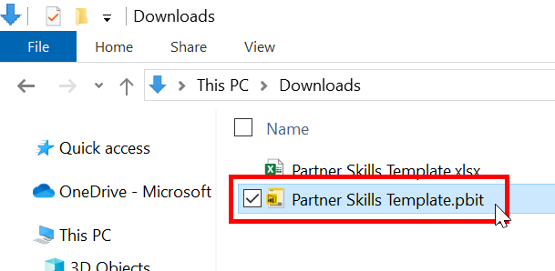

# Guide 1 - Initialize Template

## Step 1 - Download the Template Files
1. Download the **Partner Skills Template** files to your local machine.  
   * [Excel Spreadsheet](../../../raw/master/files/Partner%20Skills%20Template.xlsx) (Data Capture)
   * [Power BI Template](../../../raw/master/files/Partner%20Skills%20Template.pbit) (Report)

## Step 2 - Copy the Excel Spreadsheet File Path
1. Navigate to the **Downloads** directory.  
 
2. Single-click the Excel spreadsheet (**Partner Skills Template.xlsx**)  
 
3. While holding down the **SHIFT** key, right-click on the selected file and click **Copy as path**.  
 

## Step 3 - Initialize Power BI Template
1. Open the Power BI template (**Partner Skills Template.pbit**) by double clicking the file  
 
2. Paste the path into **Data source location**  
 
3. Delete the surrounding double quotes and click **Load**  
 
4. Once the report has loaded, click the **Save** icon  
 
5. Provide the file a name (e.g. Technical Skills Plan) and click **Save**  
 

Congratulations! You have just created an instance of a technical skills plan from the Power BI template. This instance of the skills plan is connected to the underlying spreadsheet. Any changes in the data will be reflected in the report.

Note: If you wanted to create another skills plan, start off by creating a copy of the excel spreadsheet, then repeat the steps above.