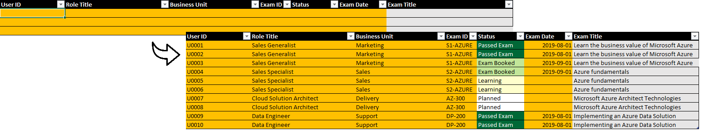

# Guide 1 - Initialize Template

## Prerequisites
Before you begin, please ensure you have the ***latest*** version of Microsoft Power BI Desktop installed on your local machine.
* [Microsoft Power BI Desktop](https://www.microsoft.com/en-us/download/details.aspx?id=45331)

<a href="#microsoft-partner-technical-skills-enablement">↥ back to top</a>

## Table of Contents
* [01 - Download the Template Files](#step-1---download-the-template-files)
* [02 - Open the Excel Spreadsheet](#step-2---open-the-excel-spreadsheet)
* [03 - Update the Worksheet: Partner](#step-3----update-worksheet-partner)
* [04 - Update the Worksheet: Competencies](#step-4---update-worksheet-competencies)
* [05 - Update the Worksheet: Business Unit](#step-5---update-worksheet-business-unit)
* [06 - Update the Worksheet: Tracker](#step-6---update-worksheet-tracker)
* [07 - Save and Close the Excel Spreadsheet](#step-7---save-and-close-the-excel-spreadsheet)
* [08 - Copy the Excel Spreadsheet File Path](#step-8---copy-the-excel-spreadsheet-file-path)
* [09 - Initialize the Power BI Template](#step-9---initialize-power-bi-template)
* [10 - Export a PDF](#step-10---export-a-pdf)

<a href="#guide-1---initialize-template">↥ back to top</a>

## Step 1 - Download the Template Files
1. Download the **Partner Skills Template** files to your local machine by clicking the links below.  
   * [Excel Spreadsheet](../../../raw/master/files/Partner%20Skills%20Template.xlsx) (Data Capture)
   * [Power BI Template](../../../raw/master/files/Partner%20Skills%20Template.pbit) (Report)

<a href="#guide-1---initialize-template">↥ back to top</a>

## Step 2 - Open the Excel Spreadsheet
1. Navigate to the folder in which you have saved the files (e.g. **Downloads**).  
  
**Tip**: Create a copy of the Excel Spreadsheet to retain an empty version for future use (e.g. Technical Skills Plan - Contoso.xlsx).  

2. Open the spreadsheet by double-clicking the file or right-click the file and click **Open**.  
 

<a href="#guide-1---initialize-template">↥ back to top</a>

## Step 3 - Update Worksheet: Partner
1. Navigate to the first worksheet (1. Partner) and populate the highlighted cells.  
 

<a href="#guide-1---initialize-template">↥ back to top</a>

## Step 4 - Update Worksheet: Competencies
1. Navigate to the second worksheet (2. Competencies) and populate the highlighted cells.  
 

<a href="#guide-1---initialize-template">↥ back to top</a>

## Step 5 - Update Worksheet: Business Unit
1. Navigate to the third worksheet (3. Business Unit) and populate the highlighted cells.  
 

<a href="#guide-1---initialize-template">↥ back to top</a>

## Step 6 - Update Worksheet: Tracker
1. Navigate to the fourth worksheet (4. Tracker) and populate the highlighted cells.  
 

<a href="#guide-1---initialize-template">↥ back to top</a>

## Step 7 - Save and Close the Excel Spreadsheet
1. Click the **Save** icon located in the top left hand corner of the window.  
 
2. Click the **Close** icon located in the top right hand corner of the window.  
 

<a href="#guide-1---initialize-template">↥ back to top</a>

## Step 8 - Copy the Excel Spreadsheet File Path
1. Navigate to the **Downloads** directory.  
 
2. While holding down the **SHIFT** key, right-click on the selected file and click **Copy as path**.  
 

<a href="#guide-1---initialize-template">↥ back to top</a>

## Step 9 - Initialize the Power BI Template
1. Open the Power BI template (**Partner Skills Template.pbit**) by double clicking the file.  
 
2. Paste the path into **Data source location** and click **Load**.  
 
3. Once the report has loaded, click the **Save** icon.  
 
5. Provide a file name (e.g. Technical Skills Plan) and click **Save**.  
 

<a href="#guide-1---initialize-template">↥ back to top</a>

## Step 10 - Export a PDF
1. Click **File** located in the top left hand corner of the window and click **Export to PDF**.   
 
2. Wait until the PDF has been generated.  
 
3. Click the **Save** icon located in the top right hand corner of the browser window.  
 
4. Rename the file (e.g. Technical Skills Plan - Contoso.pdf) and click **Save**.  
 

Congratulations! You have just created an instance of a technical skills plan from the Power BI template and exported a PDF. This instance of the skills plan is connected to the underlying spreadsheet. Any changes in the data will be reflected in the report.

Note: If you wanted to create another skills plan, create a copy of the empty spreadsheet template, open the copy, and resume from Step 3.

<a href="#guide-1---initialize-template">↥ back to top</a>

