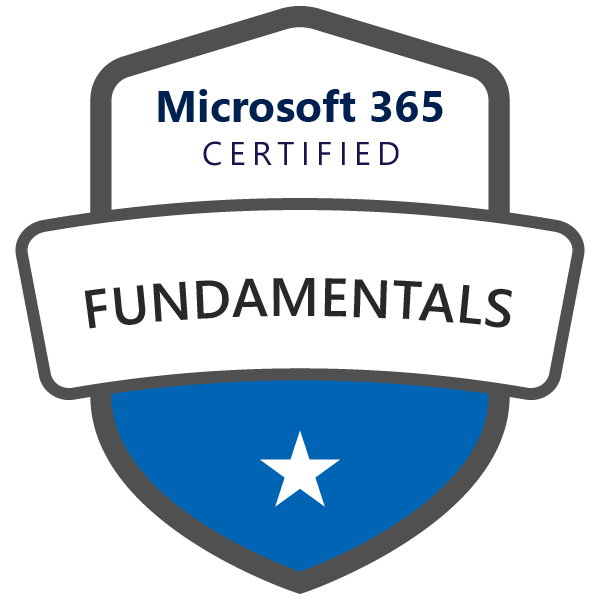
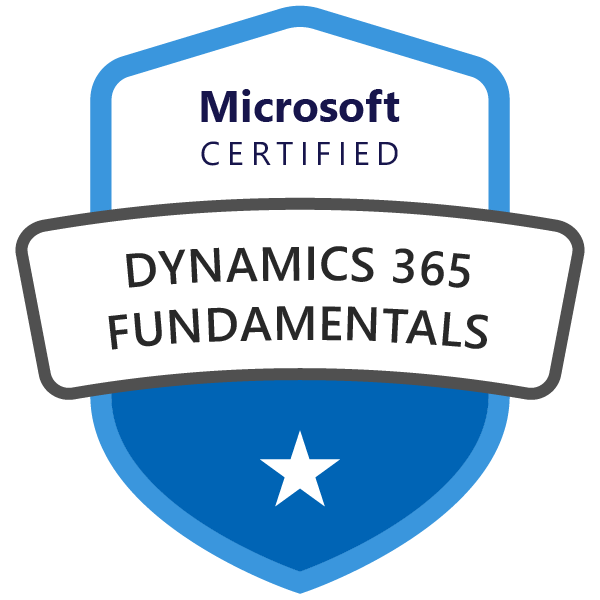

# Sales Specialist

## Table of Contents
* [Azure](#azure)
* [Microsoft 365](#microsoft-365)
* [Dynamics 365](#dynamics-365)    

<a href="#sales-specialist">↥ back to top</a>

## Azure Fundamentals (AZ-900)

| Key | Value |
| ------------- | ------------- |
| Learning Path | [Azure Fundamentals](https://docs.microsoft.com/en-us/learn/paths/azure-fundamentals/) |
| Effort | 8 hr 59 min |
| Modules | 11 |
| Level | Fundamentals (200) |
| Trophy |   |
| Related Exam | [AZ-900: Microsoft Azure Fundamentals](https://www.microsoft.com/en-us/learning/exam-az-900.aspx) |
| Related Certification | [Microsoft Certified Azure Fundamentals](https://www.microsoft.com/en-us/learning/azure-fundamentals.aspx) |
| Training | <ol><li><a href="https://docs.microsoft.com/en-us/learn/paths/azure-fundamentals/">Microsoft Learn</a></li><li><a href="https://www.taygan.co/blog/2019/02/07/az-900-azure-fundamentals-exam-preparation">Study Notes</a></li></ol> |
| Badge |   |

<a href="#sales-specialist">↥ back to top</a>

## Microsoft 365 Fundamentals (MS-900)

| Key | Value |
| ------------- | ------------- |
| Learning Path | [Microsoft 365 Fundamentals](https://docs.microsoft.com/en-us/learn/paths/m365-fundamentals/) |
| Effort | 3 hr 42 min |
| Modules | 9 |
| Level | Fundamentals (200) |
| Trophy |   |
| Related Exam | [MS-900: Microsoft 365 Fundamentals](https://www.microsoft.com/en-us/learning/exam-MS-900.aspx) |
| Related Certification | [Microsoft 365 Certified Fundamentals](https://www.microsoft.com/en-us/learning/m365-fundamentals.aspx) |
| Training | <ol><li><a href="https://aka.ms/elms-MS-900.1-about">Open edX - 900.1</a></li><li><a href="https://docs.microsoft.com/en-us/learn/paths/m365-fundamentals/">Microsoft Learn</a></li></ol> |
| Badge |   |

<a href="#sales-specialist">↥ back to top</a>

## Dynamics 365 Fundamentals (MB-900)

| Key | Value |
| ------------- | ------------- |
| Learning Path | [Dynamics 365 and Power Platform Fundamentals](https://docs.microsoft.com/en-us/learn/paths/dyn-power-plat-bus-app-fundamentals/) |
| Effort | 4 hr 19 min |
| Modules | 6 |
| Level | Fundamentals (200) |
| Trophy |   |
| Related Exam | [MB-900: Microsoft Dynamics 365 Fundamentals](https://www.microsoft.com/en-us/learning/exam-MB-900.aspx) |
| Related Certification | [Microsoft Certified Dynamics 365 Fundamentals](https://www.microsoft.com/en-us/learning/d365-fundamentals.aspx) |
| Training | <ol><li><a href="https://aka.ms/elms-MB-900.1-about">Open edX 900.1</a></li><li><a href="https://docs.microsoft.com/en-us/learn/paths/dyn-power-plat-bus-app-fundamentals/">Microsoft Learn</a></li></ol> |
| Badge |   |

<a href="#sales-specialist">↥ back to top</a>

