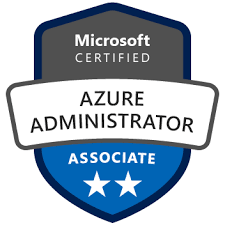
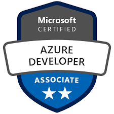
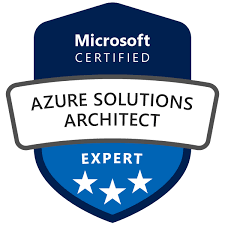

# Technical - Azure

## Table of Contents
* [AZ-103: Microsoft Azure Administrator](#az-103-microsoft-azure-administrator)
* [AZ-203: Developing Solutions for Microsoft Azure](#az-203-developing-solutions-for-microsoft-azure)
* [AZ-300: Microsoft Azure Architect Technologies](#az-300-microsoft-azure-architect-technologies)
* [AZ-301: Microsoft Azure Architect Design](#az-301-microsoft-azure-architect-design)
* [AZ-400: Microsoft Azure DevOps Solutions](#az-400-microsoft-azure-devops-solutions)
* [AZ-500: Microsoft Azure Security Technologies](#az-500-microsoft-azure-security-technologies)
* [AZ-900: Microsoft Azure Fundamentals](#az-900-microsoft-azure-fundamentals)

<a href="#technical---azure">↥ back to top</a>

## AZ-103: Microsoft Azure Administrator

| Key | Value |
| ------------- | ------------- |
| Exam | [AZ-103: Microsoft Azure Administrator](https://www.microsoft.com/en-us/learning/exam-AZ-103.aspx) |
| Related Certification | [Microsoft Certified: Azure Administrator Associate](https://www.microsoft.com/en-us/learning/azure-administrator.aspx) |
| Level | Associate (300) |
| Training | <ol><li><a href="https://aka.ms/openedx-AZ-103.1-about">Open edX - 103.1</a></li><li><a href="https://docs.microsoft.com/en-us/learn/browse/?products=azure&resource_type=learning%20path&roles=administrator">Microsoft Learn</a></li></ol> |
| Badge |   |

<a href="#technical---azure">↥ back to top</a>

## AZ-203: Developing Solutions for Microsoft Azure

| Key | Value |
| ------------- | ------------- |
| Exam | [AZ-203: Developing Solutions for Microsoft Azure](https://www.microsoft.com/en-us/learning/exam-AZ-203.aspx) |
| Related Certification | [Microsoft Certified: Azure Developer Associate](https://www.microsoft.com/en-us/learning/azure-developer.aspx) |
| Level | Associate (300) |
| Training | <ol><li><a href="https://aka.ms/openedx-AZ-203.1-about">Open edX - 203.1</a></li><li><a href="https://aka.ms/openedx-AZ-203.2-about">Open edX - 203.2</a></li><li><a href="https://aka.ms/openedx-AZ-203.3-about">Open edX - 203.3</a></li><li><a href="https://aka.ms/openedx-AZ-203.4-about">Open edX - 203.4</a></li><li><a href="https://aka.ms/openedx-AZ-203.5-about">Open edX - 203.5</a></li><li><a href="https://aka.ms/openedx-AZ-203.6-about">Open edX - 203.6</a></li><li><a href="https://docs.microsoft.com/en-us/learn/browse/?products=azure&resource_type=learning%20path&roles=developer">Microsoft Learn</a></li></ol> |
| Badge |   |

<a href="#technical---azure">↥ back to top</a>

## AZ-300: Microsoft Azure Architect Technologies

| Key | Value |
| ------------- | ------------- |
| Exam | [AZ-300: Microsoft Azure Architect Technologies](https://www.microsoft.com/en-us/learning/exam-AZ-300.aspx) |
| Related Certification | [Microsoft Certified: Azure Solutions Architect Expert](https://www.microsoft.com/en-us/learning/azure-solutions-architect.aspx) |
| Level | Expert (400) |
| Training | <ol><li><a href="https://aka.ms/openedx-AZ-300.1-about">Open edX - 300.1</a></li><li><a href="https://aka.ms/openedx-AZ-300.2-about">Open edX - 300.2</a></li><li><a href="https://aka.ms/openedx-AZ-300.3-about">Open edX - 300.3</a></li><li><a href="https://aka.ms/openedx-AZ-300.4-about">Open edX - 300.4</a></li><li><a href="https://aka.ms/openedx-AZ-300.6-about">Open edX - 300.6</a></li><li><a href="https://docs.microsoft.com/en-us/learn/browse/?products=azure&resource_type=learning%20path&roles=solution-architect">Microsoft Learn</a></li></ol> |
| Badge |   |

<a href="#technical---azure">↥ back to top</a>

## AZ-301: Microsoft Azure Architect Design

| Key | Value |
| ------------- | ------------- |
| Exam | [AZ-301: Microsoft Azure Architect Design](https://www.microsoft.com/en-us/learning/exam-az-301.aspx) |
| Related Certification | [Microsoft Certified: Azure Solutions Architect Expert](https://www.microsoft.com/en-us/learning/azure-solutions-architect.aspx) |
| Level | Expert (400) |
| Training | <ol><li><a href="https://aka.ms/openedx-AZ-301.1-about">Open edX - 301.1</a></li><li><a href="https://aka.ms/openedx-AZ-301.2-about">Open edX - 301.2</a></li><li><a href="https://aka.ms/openedx-AZ-301.3-about">Open edX - 301.3</a></li><li><a href="https://aka.ms/openedx-AZ-301.4-about">Open edX - 301.4</a></li><li><a href="https://docs.microsoft.com/en-us/learn/browse/?products=azure&resource_type=learning%20path&roles=solution-architect">Microsoft Learn</a></li></ol> |
| Badge |   |

<a href="#technical---azure">↥ back to top</a>

## AZ-400: Microsoft Azure DevOps Solutions

| Key | Value |
| ------------- | ------------- |
| Exam | [AZ-400: Microsoft Azure DevOps Solutions](https://www.microsoft.com/en-us/learning/exam-az-400.aspx) |
| Related Certification | [Microsoft Certified: Azure DevOps Engineer Expert](https://www.microsoft.com/en-us/learning/azure-devops.aspx) |
| Level | Expert (400) |
| Training | <ol><li><a href="https://aka.ms/elms-AZ-400.1-about">Open edX - 400.1</a></li><li><a href="https://aka.ms/elms-AZ-400.2-about">Open edX - 400.2</a></li><li><a href="https://aka.ms/elms-AZ-400.3-about">Open edX - 400.3</a></li><li><a href="https://aka.ms/elms-AZ-400.4-about">Open edX - 400.4</a></li><li><a href="https://aka.ms/elms-AZ-400.5-about">Open edX - 400.5</a></li><li><a href="https://aka.ms/elms-AZ-400.6-about">Open edX - 400.6</a></li><li><a href="https://aka.ms/elms-AZ-400.7-about">Open edX - 400.7</a></li><li><a href="https://docs.microsoft.com/en-us/learn/browse/?resource_type=learning%20path&products=azure&roles=devops-engineer">Microsoft Learn</a></li></ol> |
| Badge |   |

<a href="#technical---azure">↥ back to top</a>

## AZ-500: Microsoft Azure Security Technologies

| Key | Value |
| ------------- | ------------- |
| Exam | [AZ-500: Microsoft Azure Security Technologies](https://www.microsoft.com/en-us/learning/exam-az-500.aspx) |
| Related Certification | [Microsoft Certified: Azure Security Engineer Associate](https://www.microsoft.com/en-us/learning/azure-security-engineer.aspx) |
| Level | Associate (300) |
| Training | <ol><li><a href="https://aka.ms/elms-AZ-500.0-about">Open edX - 500.0</a></li></ol> |
| Badge |   |

<a href="#technical---azure">↥ back to top</a>

## AZ-900: Microsoft Azure Fundamentals

| Key | Value |
| ------------- | ------------- |
| Exam | [AZ-900: Microsoft Azure Fundamentals](https://www.microsoft.com/en-us/learning/exam-az-900.aspx) |
| Related Certification | [Microsoft Certified Azure Fundamentals](https://www.microsoft.com/en-us/learning/azure-fundamentals.aspx) |
| Level | Fundamentals (200) |
| Training | <ol><li><a href="https://docs.microsoft.com/en-us/learn/paths/azure-fundamentals/">Microsoft Learn</a></li><li><a href="https://www.taygan.co/blog/2019/02/07/az-900-azure-fundamentals-exam-preparation">Study Notes</a></li></ol> |
| Badge |   |

<a href="#technical---azure">↥ back to top</a>

