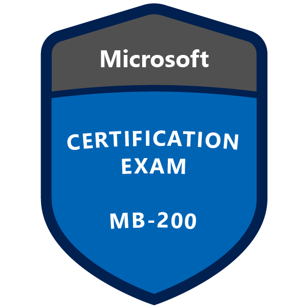
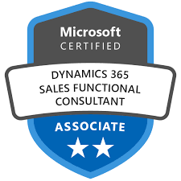
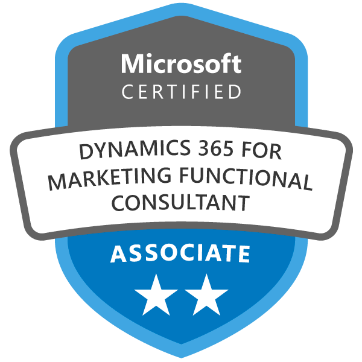
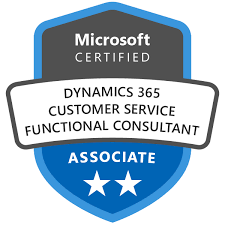
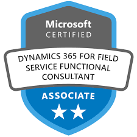
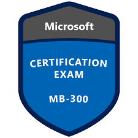
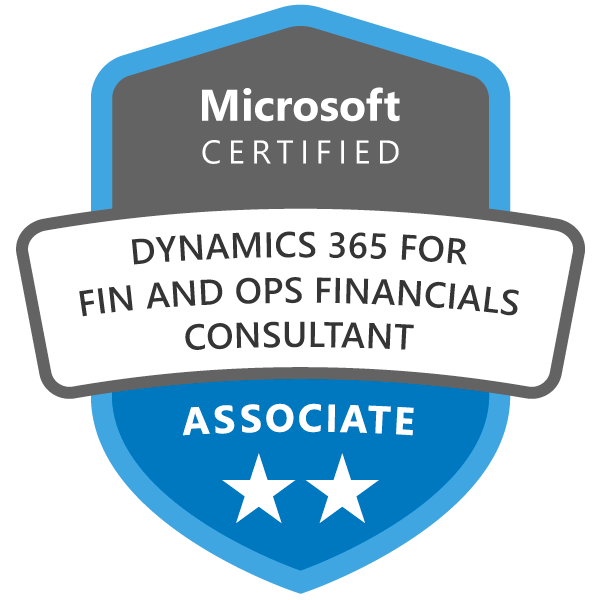
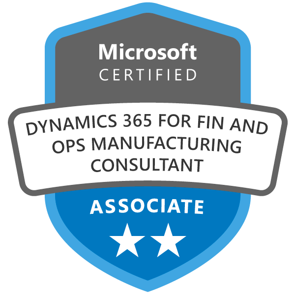
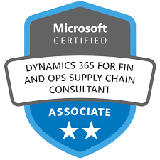

# Technical - Business Applications

## Table of Contents
* [MB-200: Microsoft Dynamics 365 Customer Engagement Core](#mb-200-microsoft-dynamics-365-customer-engagement-core)
* [MB-210: Microsoft Dynamics 365 for Sales](#mb-210-microsoft-dynamics-365-for-sales)
* [MB-220: Microsoft Dynamics 365 for Marketing](#mb-220-microsoft-dynamics-365-for-marketing)
* [MB-230: Microsoft Dynamics 365 for Customer Service](#mb-230-microsoft-dynamics-365-for-customer-service)
* [MB-240: Microsoft Dynamics 365 for Field Service](#mb-240-microsoft-dynamics-365-for-field-service)
* [MB-300: Microsoft Dynamics 365 Unified Operations Core](#mb-300-microsoft-dynamics-365-unified-operations-core)
* [MB-310: Microsoft Dynamics 365 for Finance and Operations, Financials](#mb-310-microsoft-dynamics-365-for-finance-and-operations-financials)
* [MB-320: Microsoft Dynamics 365 for Finance and Operations, Manufacturing](#mb-320-microsoft-dynamics-365-for-finance-and-operations-manufacturing)
* [MB-330: Microsoft Dynamics 365 for Finance and Operations, Supply Chain Management](#mb-330-microsoft-dynamics-365-for-finance-and-operations-supply-chain-management)
* [MB-900: Microsoft Dynamics 365 Fundamentals](#mb-900-microsoft-dynamics-365-fundamentals)

<a href="#technical---business-applications">↥ back to top</a>

## MB-200: Microsoft Dynamics 365 Customer Engagement Core

| Key | Value |
| ------------- | ------------- |
| Exam | [MB-200: Microsoft Dynamics 365 Customer Engagement Core](https://www.microsoft.com/en-us/learning/exam-MB-200.aspx) |
| Related Certification | Part of the requirements for multiple certifications |
| Level | Associate (300) |
| Training | <ol><li><a href="https://aka.ms/elms-MB-200.1-about">Open edX 200.1</a></li><li><a href="https://aka.ms/elms-MB-200.2-about">Open edX 200.2</a></li><li><a href="https://aka.ms/elms-MB-200.3-about">Open edX 200.3</a></li><li><a href="https://aka.ms/elms-MB-200.4-about">Open edX 200.4</a></li><li><a href="https://docs.microsoft.com/en-us/learn/browse/?resource_type=learning%20path&products=dynamics-customer-engagement&roles=functional-consultant">Microsoft Learn</a></li></ol> |
| Badge |   |

<a href="#technical---business-applications">↥ back to top</a>

## MB-210: Microsoft Dynamics 365 for Sales

| Key | Value |
| ------------- | ------------- |
| Exam | [MB-210: Microsoft Dynamics 365 for Sales](https://www.microsoft.com/en-us/learning/exam-MB-210.aspx) |
| Related Certification | [Microsoft Certified: Dynamics 365 for Sales Functional Consultant Associate](https://www.microsoft.com/en-us/learning/d365-functional-consultant-sales.aspx) |
| Level | Associate (300) |
| Training | <ol><li><a href="https://aka.ms/elms-MB-210.1-about">Open edX 210.1</a></li><li><a href="https://docs.microsoft.com/en-us/learn/browse/?resource_type=learning%20path&products=dynamics-sales&roles=functional-consultant">Microsoft Learn</a></li></ol> |
| Badge |   |

<a href="#technical---business-applications">↥ back to top</a>

## MB-220: Microsoft Dynamics 365 for Marketing

| Key | Value |
| ------------- | ------------- |
| Exam | [MB-220: Microsoft Dynamics 365 for Marketing](https://www.microsoft.com/en-us/learning/exam-MB-220.aspx) |
| Related Certification | [Microsoft Certified: Dynamics 365 for Marketing Functional Consultant Associate](https://www.microsoft.com/en-us/learning/d365-functional-consultant-marketing.aspx) |
| Level | Associate (300) |
| Training | <ol><li><a href="https://docs.microsoft.com/en-us/learn/browse/?resource_type=learning%20path&roles=functional-consultant&products=dynamics-marketing">Microsoft Learn</a></li></ol> |
| Badge |   |

<a href="#technical---business-applications">↥ back to top</a>

## MB-230: Microsoft Dynamics 365 for Customer Service

| Key | Value |
| ------------- | ------------- |
| Exam | [MB-230: Microsoft Dynamics 365 for Customer Service](https://www.microsoft.com/en-us/learning/exam-MB-230.aspx) |
| Related Certification | [Microsoft Certified: Dynamics 365 for Customer Service Functional Consultant Associate](https://www.microsoft.com/en-us/learning/d365-functional-consultant-customer-service.aspx) |
| Level | Associate (300) |
| Training | <ol><li><a href="https://aka.ms/elms-MB-230.1-about">Open edX 230.1</a></li><li><a href="https://docs.microsoft.com/en-us/learn/browse/?resource_type=learning%20path&roles=functional-consultant&products=dynamics-customer-service">Microsoft Learn</a></li></ol> |
| Badge |   |

<a href="#technical---business-applications">↥ back to top</a>

## MB-240: Microsoft Dynamics 365 for Field Service

| Key | Value |
| ------------- | ------------- |
| Exam | [MB-240: Microsoft Dynamics 365 for Field Service](https://www.microsoft.com/en-us/learning/exam-MB-240.aspx) |
| Related Certification | [Microsoft Certified: Dynamics 365 for Field Service Functional Consultant Associate](https://www.microsoft.com/en-us/learning/d365-functional-consultant-field-service.aspx) |
| Level | Associate (300) |
| Training | <ol><li><a href="https://aka.ms/elms-MB-240.1-about">Open edX 240.1</a></li><li><a href="https://aka.ms/elms-MB-240.2-about">Open edX 240.2</a></li><li><a href="https://aka.ms/elms-MB-240.3-about">Open edX 240.3</a></li><li><a href="https://docs.microsoft.com/en-us/learn/browse/?resource_type=learning%20path&roles=functional-consultant&products=dynamics-field-service">Microsoft Learn</a></li></ol> |
| Badge |   |

<a href="#technical---business-applications">↥ back to top</a>

## MB-300: Microsoft Dynamics 365 Unified Operations Core

| Key | Value |
| ------------- | ------------- |
| Exam | [MB-300: Microsoft Dynamics 365 Unified Operations Core](https://www.microsoft.com/en-us/learning/exam-MB-300.aspx) |
| Related Certification | Part of the requirements for multiple certifications |
| Level | Associate (300) |
| Training | Not Available |
| Badge |   |

<a href="#technical---business-applications">↥ back to top</a>

## MB-310: Microsoft Dynamics 365 for Finance and Operations, Financials

| Key | Value |
| ------------- | ------------- |
| Exam | [MB-310: Microsoft Dynamics 365 for Finance and Operations, Financials](https://www.microsoft.com/en-us/learning/exaMB-31000.aspx) |
| Related Certification | [Microsoft Certified: Dynamics 365 for Finance and Operations, Financials Functional Consultant Associate](https://www.microsoft.com/en-us/learning/d365-functional-consultant-financials.aspx) |
| Level | Associate (300) |
| Training | <ol><li><a href="https://docs.microsoft.com/en-us/learn/browse/?resource_type=learning%20path&roles=functional-consultant&products=dynamics-finance-operations">Microsoft Learn</a></li></ol> |
| Badge |   |

<a href="#technical---business-applications">↥ back to top</a>

## MB-320: Microsoft Dynamics 365 for Finance and Operations, Manufacturing

| Key | Value |
| ------------- | ------------- |
| Exam | [MB-320: Microsoft Dynamics 365 for Finance and Operations, Manufacturing](https://www.microsoft.com/en-us/learning/exam-MB-320.aspx) |
| Related Certification | [Microsoft Certified: Dynamics 365 for Finance and Operations, Manufacturing Functional Consultant Associate](https://www.microsoft.com/en-us/learning/d365-functional-consultant-manufacturing.aspx) |
| Level | Associate (300) |
| Training | <ol><li><a href="https://docs.microsoft.com/en-us/learn/browse/?resource_type=learning%20path&roles=functional-consultant&products=dynamics-finance-operations">Microsoft Learn</a></li></ol> |
| Badge |   |

<a href="#technical---business-applications">↥ back to top</a>

## MB-330: Microsoft Dynamics 365 for Finance and Operations, Supply Chain Management

| Key | Value |
| ------------- | ------------- |
| Exam | [MB-330: Microsoft Dynamics 365 for Finance and Operations, Supply Chain Management](https://www.microsoft.com/en-us/learning/exam-MB-330.aspx) |
| Related Certification | [Microsoft Certified: Dynamics 365 for Finance and Operations, Supply Chain Management Functional Consultant Associate](https://www.microsoft.com/en-us/learning/d365-functional-consultant-supply-chain-management.aspx) |
| Level | Associate (300) |
| Training | <ol><li><a href="https://docs.microsoft.com/en-us/learn/browse/?resource_type=learning%20path&roles=functional-consultant&products=dynamics-finance-operations">Microsoft Learn</a></li></ol> |
| Badge |   |

<a href="#technical---business-applications">↥ back to top</a>
